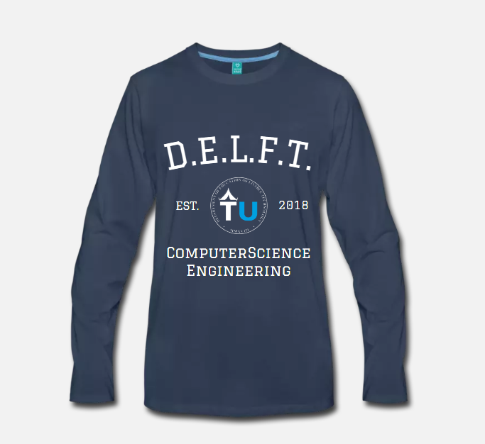

# competitions

Every month, me (jonathan) will give *10 euros* __(note, this month you can win a tshirt)__ to the creator of the best submission that conforms to the monthly challenge.
me, together with Julius will judge.

Ideas for future challenges are welcome

# how to submit:

after you're done, make a gist (on github) and message me the link (discord: jonay2000#6848) or Julius (discord: J00LZ#9386). the link will be added to the file of the current competiton.

**Important** add compilation instructions to the gist so we can check the submission

multiple submissions are allowed

# this month:

## Linked Stack
Let's learn c! 

Implement, using the C programming language, a linked stack. this is a datastructure that performs the same operations as any stack but its implemented using a linked list. this means every `link` consists of a value (integer) and a pointer (next link). pushing to the stack should make a new link pointing to the previous last link, and popping from the stack should destroy the last created link and return it's (integer) value. (Watch out for memory leaks!) From all the submissions conforming to the following items:

* implemented using links
* links are structs
* pushing and popping operations are supported
* dynamically allocated with malloc and free
* no memory leaks

One will be (randomly) chosen to receive a custom TUdelft t-shirt.

*PLEASE POST PRIVATELY TO JONATHAN OR JULIUS*

note: to compile a c program (.c file) you can use gcc -o out <filename>.c just like you would with assembly

[link](linkedstack/README.md)

Deadline: october the 25th, 2018

# planned competitions:

2 in october because hacktoberfest :)

* october 10 - october 25: Linked Stack    
* october 25 - november 10: -----------------------------    
* novermber 10 - november 31: -----------------------------    

# previous challenges:

| challenge | winner | 
| --------- | ------ | 
| [obfuscated fizzbuzz](obfuscated%20fizzbuzz/README.md) | None	|
| [linked stack](linkedstack/README.md) | None |

# possible future challenges:

* create some sort of pathfinding algorithm
* sorting algorithms (suggestions welcome)
* regex parser (probably too hard)
* creating a toy (turing complete) programming language of choice
* command line 'physics engine' that bounces a ball around
* commandline pong AI vs AI
* game jam with a twist (e.g. platformer with one input, shooter without shooting, etc)
* code golf (look it up)
* arithmetic expression parser in c

suggestions are welcome
